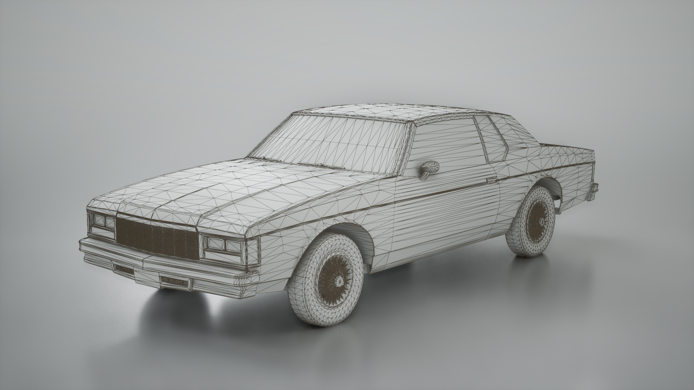
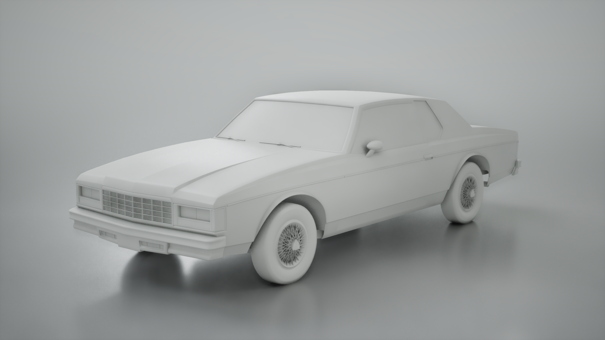
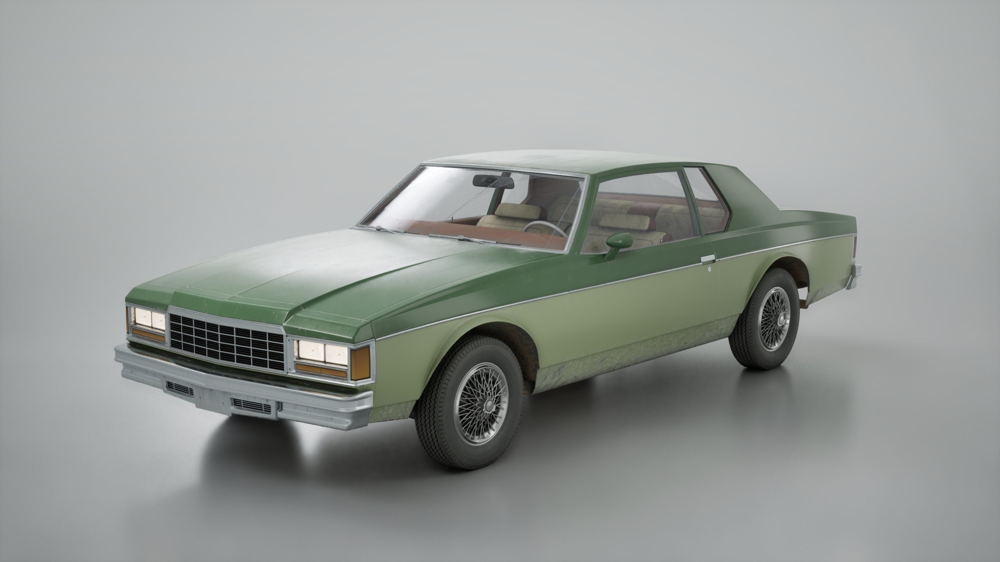
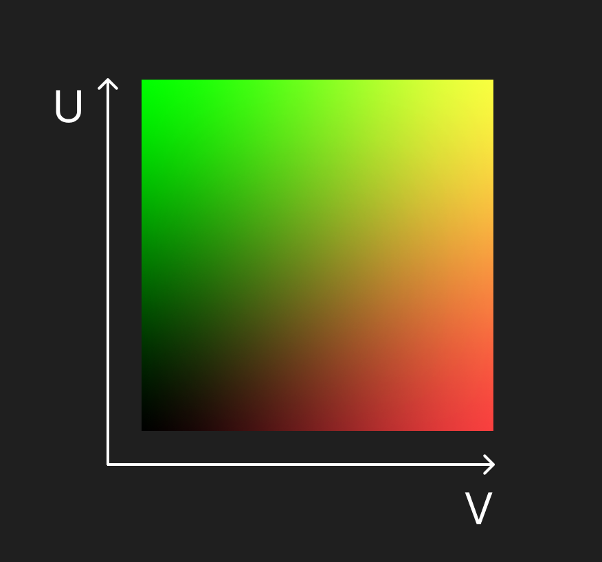
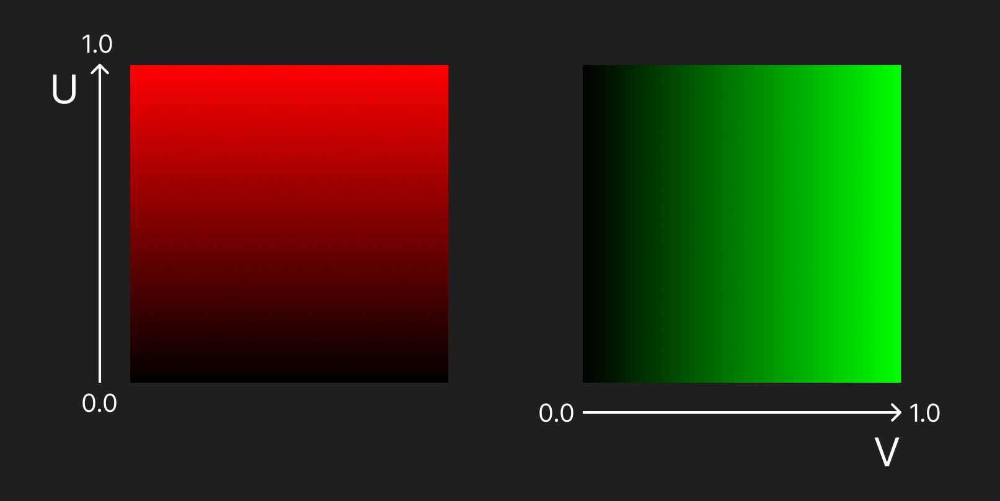
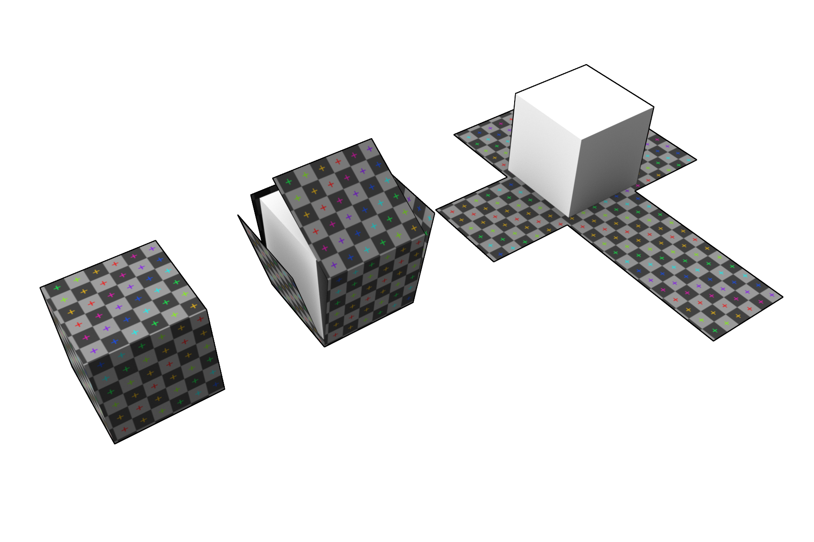

# Базовых понятий: текстуры, материалы, шейдеры и связанные технологии
## 1. Текстуры (Textures)

**Текстура (texture)** [https://en.wikipedia.org/wiki/Image_texture] в компьютерной графике **представляет собой растровое изображение** (двумерный набор данных) [https://en.wikipedia.org/wiki/Raster_graphics], которое **используется для хранения данных о визуальных свойствах поверхности трёхмерного объекта.** Проще говоря, текстура - это информация, которая проецируется (накладывается) на геометрию модели и позволяет значительно увеличить уровень визуальной детализации без необходимости усложнения самой геометрии.

Использование текстур является одним из фундаментальных принципов современной компьютерной графики. Без них невозможно представить реалистичную визуализацию в игровых движках, киноиндустрии, системах виртуальной реальности, архитектурной визуализации и других областях компьютерной графики.

В основе большинства трёхмерных моделей лежит полигональная геометрия [https://en.wikipedia.org/wiki/Polygon_mesh]. Объект описывается набором вершин, рёбер и полигонов (чаще всего треугольников). Такая **геометрия задаёт форму объекта, однако сама по себе она не содержит информации о цвете, структуре материала, микрорельефе или других характеристиках поверхности.** Без текстур большинство моделей выглядели бы как однотонные формы без деталей.

>Модель автомобиля без текстур с отображением полигональной сетки (47 050 полигонов)

>Модель автомобиля без текстур

>Модель автомобиля без текстур вблизи

**Именно текстуры позволяют передать внешний вид материалов.** Например: древесину, камень, металл, пластик, ткань, кожу или бетон. Благодаря текстурам можно изобразить царапины, загрязнения, следы износа, поры материала, неровности поверхности и множество других визуальных особенностей.
При рендеринге сцены графический процессор (GPU) [https://en.wikipedia.org/wiki/Graphics_processing_unit] использует данные текстур для вычисления освещения, цвета и других характеристик пикселей.

>Модель автомобиля с текстурами с отображением полигональной сетки (47 050 полигонов)

>Модель автомобиля с текстурами

>Модель автомобиля с текстурами вблизи

Таким образом, представленные примеры наглядно показывают, что **при сохранении исходной геометрии именно наложение текстур обеспечивает модели необходимую визуальную проработку и детализацию.** Это позволяет имитировать сложные поверхности, не увеличивая вычислительную нагрузку на обработку полигональной сетки.

Одним из ключевых преимуществ текстур является **возможность значительно снизить количество полигонов в модели.** Например, если требуется изобразить кирпичную стену, можно либо смоделировать каждый кирпич геометрически, либо использовать плоскую поверхность с текстурой кирпичной кладки. Второй подход позволяет получить **визуально схожий результат при значительно меньшей нагрузке на графическую процессор (GPU).**

### Вывод
Таким образом, текстурирование является эффективным методом разделения геометрической формы и визуальной детализации объекта. Использование растровых данных вместо усложнения полигональной сетки позволяет достичь высокого уровня фотореализма, минимизируя при этом вычислительные затраты при рендеринге и обеспечивая гибкость в имитации различных физических материалов.

## Представление текстурных данных

С технической точки зрения **текстура представляет собой двумерный массив данных.** Наиболее распространённым типом текстуры является **растровое изображение**, состоящее из пикселей. Каждый пиксель содержит информацию о цвете, которая обычно хранится в формате RGB или RGBA [https://en.wikipedia.org/wiki/RGB_color_model].

RGB обозначает три цветовых канала:

• Red - красный
• Green - зелёный
• Blue - синий

Комбинация этих трёх каналов позволяет получить практически любой цвет. В некоторых случаях используется также альфа-канал (Alpha), который отвечает за прозрачность.

Помимо стандартных цветовых текстур в компьютерной графике широко используются так называемые data textures - текстуры, содержащие не цвет, а различные числовые данные. Такие текстуры используются, например, для хранения нормалей, параметров отражательной способности или коэффициентов шероховатости.

## UV-координаты

Для корректного отображения текстуры на поверхности трёхмерной модели используется система текстурных координат, называемая UV-координатами (UV coordinates) [https://en.wikipedia.org/wiki/UV_mapping]. Данная система определяет соответствие между точками поверхности трёхмерного объекта и координатами пикселей в двумерном изображении текстуры.

Каждая вершина полигональной модели содержит набор UV-координат, которые указывают, какая точка текстуры должна быть сопоставлена данной вершине. При рендеринге графический процессор выполняет интерполяцию UV-координат между вершинами полигона, благодаря чему для каждого пикселя поверхности определяется точная точка выборки (sampling) из текстуры.

>Вид UV-координат (UV-Coordinates)

Название координат происходит от букв U и V, которые используются вместо X и Y, чтобы избежать путаницы с координатами трёхмерного пространства. В трёхмерной сцене положение объектов определяется координатами X, Y, Z, тогда как координаты U и V используются исключительно для описания положения точки на поверхности текстуры.

UV-координаты формируют так называемое UV-пространство (UV space), представляющее собой двумерную систему координат, в которой каждая точка соответствует определённому положению на текстуре. В большинстве случаев координаты нормализованы и принимают значения в диапазоне от 0.0 до 1.0 по обеим осям.

Технически UV-координаты могут храниться как двухканальные данные, где первый канал соответствует координате U, а второй - координате V. При визуализации их отображают как цветовой градиент, где компонент U записывается в красный канал (R), а компонент V - в зелёный канал (G). Такое представление позволяет наглядно увидеть распределение координат на поверхности модели.

>Вид градиентов UV-координат

Для того чтобы текстура могла быть корректно применена к трёхмерной модели, необходимо создать UV-развёртку (UV unwrapping). UV-развёртка представляет собой процесс преобразования поверхности трёхмерного объекта в двумерное представление, в котором полигоны модели размещаются в пространстве текстуры.

>UV-развёртка

Качество UV-развёртки напрямую влияет на качество отображения текстур. Неправильное распределение UV-координат может приводить к растяжениям изображения, искажениям и другим визуальным артефактам.

### 1.4 Сэмплирование текстур

В процессе рендеринга текстура не используется напрямую как изображение. Вместо этого выполняется операция выборки данных из текстуры, которая называется сэмплированием (texture sampling).

Во время выполнения шейдера графический процессор получает координаты выборки и извлекает соответствующее значение из текстуры. Это значение может использоваться как цвет пикселя, коэффициент отражения света или любой другой параметр.

Каждая текстура в материале должна быть сэмплирована с помощью специальной операции выборки. В графических движках эта операция обычно реализуется через узлы Texture Sample.

[МЕСТО ДЛЯ ССЫЛКИ НА ИСТОЧНИК: texture sampling]

Процесс сэмплирования может включать дополнительные этапы:

• интерполяцию значений между пикселями текстуры
• применение фильтрации
• выбор уровня детализации

#### Albedo (Base Color)

Albedo текстура содержит базовый цвет поверхности без влияния освещения. В отличие от традиционных диффузных текстур, она не должна содержать информацию о тенях, бликах или глобальном освещении.

[МЕСТО ДЛЯ ИЛЛЮСТРАЦИИ: пример albedo карты]

#### Metallic

Metallic карта определяет, является ли поверхность металлической или диэлектрической. В большинстве случаев значения принимают либо 0 (неметалл), либо 1 (металл).

#### Roughness

Roughness карта описывает микрошероховатость поверхности, которая влияет на характер отражения света.

Низкие значения roughness приводят к зеркальным отражениям, тогда как высокие значения создают рассеянные отражения.

#### Normal Map

Normal карта используется для имитации микрорельефа поверхности без изменения геометрии модели. Она хранит информацию о направлении нормали поверхности для каждого пикселя.

[МЕСТО ДЛЯ ИЛЛЮСТРАЦИИ: normal map]

#### Ambient Occlusion

AO карта хранит информацию о затенении в местах, куда свет попадает с меньшей вероятностью.

[МЕСТО ДЛЯ ИЛЛЮСТРАЦИИ: AO карта]

---

## 2. Цветовые пространства

### 2.1 Линейное пространство

Большинство вычислений освещения выполняется в линейном цветовом пространстве. В линейном пространстве значения цвета пропорциональны физической интенсивности света.

### 2.2 sRGB

sRGB представляет собой стандартное цветовое пространство, используемое большинством дисплеев и графических форматов.

[МЕСТО ДЛЯ ССЫЛКИ НА ИСТОЧНИК: sRGB]

Текстуры, предназначенные для хранения цветовой информации (например Albedo), обычно сохраняются в пространстве sRGB. Перед использованием в вычислениях они преобразуются в линейное пространство.

Текстуры, содержащие данные (например Roughness, Metallic, Normal), должны использоваться в линейном пространстве без преобразования.

[МЕСТО ДЛЯ ИЛЛЮСТРАЦИИ: разница sRGB и Linear]

---

## 3. Материалы

Материал представляет собой систему правил, определяющих взаимодействие поверхности объекта со светом.

Материал объединяет:

• текстуры
• числовые параметры
• математические операции
• шейдерные программы

[МЕСТО ДЛЯ ССЫЛКИ НА ИСТОЧНИК: материалы в графике]

### 3.1 Материалы в Unreal Engine

В Unreal Engine материалы создаются с помощью визуального редактора Material Editor.

Material Editor представляет собой графовую систему, в которой узлы выполняют различные операции:

• выборку текстур
• математические вычисления
• преобразования данных

Каждый материал после компиляции преобразуется в шейдерный код, который выполняется на графическом процессоре.

[МЕСТО ДЛЯ ИЛЛЮСТРАЦИИ: Material Editor]

### 3.2 Поток данных внутри материала

Каждая текстура, используемая в материале, должна быть считана с помощью операции texture sampling. Полученные значения затем передаются в различные входы материала.

Например:

• Albedo → Base Color
• Roughness → Roughness
• Metallic → Metallic
• Normal Map → Normal

После этого значения используются шейдером при расчёте освещения.

---