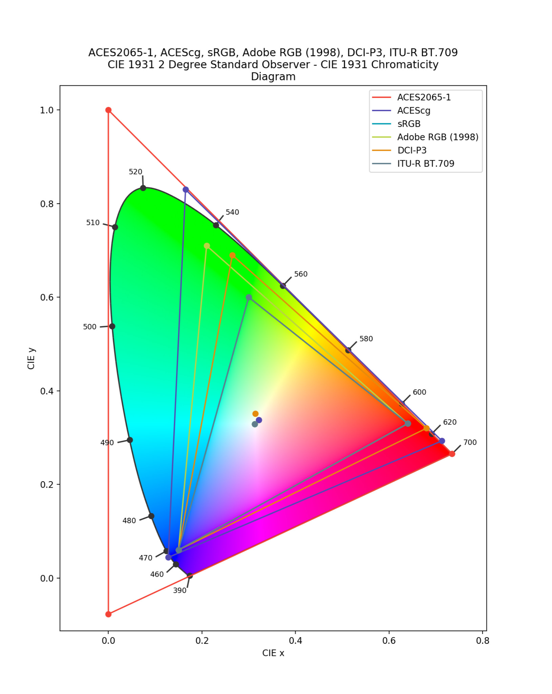
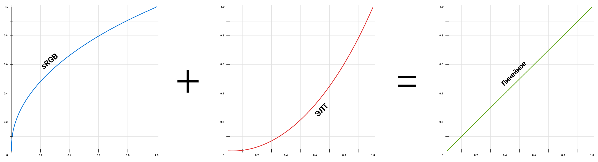
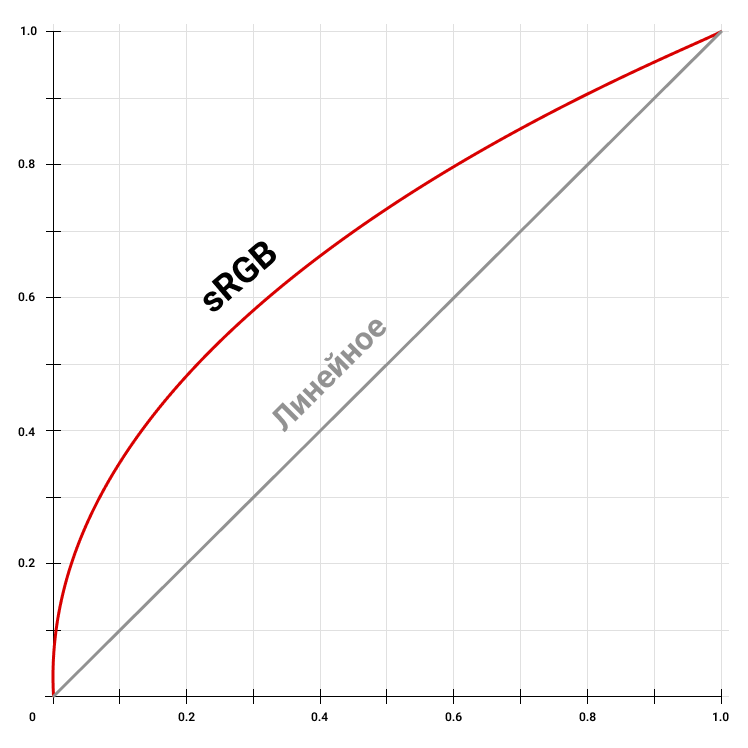
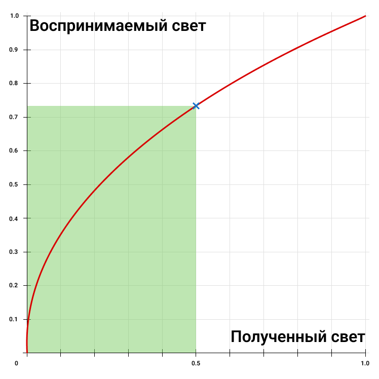
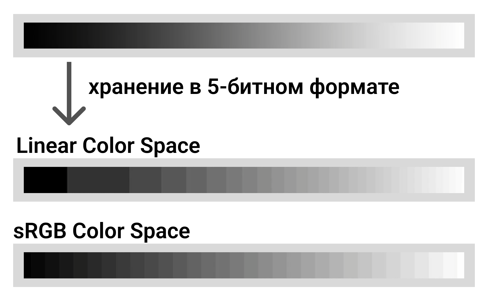

# **Анализ цветовых пространств sRGB и Linear в контексте PBR**

## **Обоснование исследования проблематики цветовых пространств**

В ходе выполнения задачи по анализу теоретических основ PBR-рендеринга и разработке логики визуализации для отладочных режимов (Overview Mode, Albedo Check), стало ясно, что необходимо исследование работы цветовых пространств и из разницы. 

Также было проведено исследование внутреннего пайплайна обработки текстур в Unreal Engine 5.
В процессе извлечения сырых данных из геометрического буфера (G-Buffer) через узел SceneTexture было выявлено, что прямое математическое сравнение этих данных с референсными значениями из стандартов PBR приводит к некорректным результатам. Индикаторные маски и ползунки интерфейса смещались и отображали неверные цвета.

Дальнейший анализ показал, что проблемой является сравнение данных, находящихся в разных цветовых пространствах.

Для обеспечения математической точности разрабатываемого модуля валидации потребовалось формализовать теоретическую базу цветовых пространств и интегрировать алгоритмы их конвертаций непосредственно в HLSL-код инструмента. Ниже представлены результаты этого исследования.

## **Введение в проблематику цветовых пространств**

Для соблюдения физически корректного рендеринга (PBR) требуется точный математический расчёт поведения света при его взаимодействии с поверхностями различных типов. Для того чтобы вычисление освещения, отражений и преломлений происходило с физической достоверностью, все математические операции в графических движках (включая Unreal Engine 5) должны выполняться исключительно в линейном цветовом пространстве (Linear Color Space).

Однако в индустрии компьютерной графики создание почти любого графического контента (текстурирование, настройка цветов и другое) и его финальное отображение на мониторах конечных пользователей почти всегда происходит в нелинейном цветовом пространстве sRGB. Некорректная конвертация данных между цветовыми пространствами или непонимание их работы на этапе разработки является одной из самых частых причин критических графических артефактов. К таким артефактам относятся: избыточно "грязные" или неестественно контрастные тени, пересвеченные блики, неправильное отображение шерховатости или металичности, а так же возможно нарушение закона сохранения энергии.

Для разработки модуля визуального анализа PBR-материалов необходимо проанализировать и понять работу различных цветовых пространств, а так же разобраться в их отличиях. Разрабатываемый инструмент отладки должен получать сырые данные из геометрического буфера (G-Buffer), правильно их интерпретировать с учетом гамма-коррекции и выводить на экран корректную диагностическую информацию.

***Нужен ли вывод в введении?***

## **Что такое цветовое пространство**

Для начала необходимо определить базовую терминологию. Цветовое пространство (Color Space)[https://en.wikipedia.org/wiki/Color_space] - это определённая система организации цвтов. Оно обеспечивает воспроизводимое отображение цвета на различных устройствах.

В компьютерной графике подавляющее большинство цветовых пространств основано на эталонной модели CIE 1931 xyz[https://en.wikipedia.org/wiki/CIE_1931_color_space], разработанной Международной комиссией по освещению CIE (International Commission on Illumination) в 1931 году. Эта модель описывает все цвета, которые способен увидеть обычный среднестатистический человек.

Однако, почти все распространённые устройства (матрицы телевизоров, диспеи мониторов, экраны смартфонов) не способны воспроизвести все видимые человеческим глазом цвета.
Из-за этого технического ограничения были придуманы другие цветовые пространства, некоторые из которых могут быть воспризведены дисплеями, но охватыюват меньше цветов, чем способен увидеть обычный человек. Также существуют цветовые пространста, охватывающие даже больше цветов, чем способен увидеть человеческое глаз, но предназначены они для других узконаправленных задач. 

> Хроматическая диаграмма CIE 1931 xyz с демонстрацией различных цветовых охватов.

Любое современное цветовое пространство (будь то sRGB, Adobe RGB, ACEScg и дургие) задается тремя ключевыми характеристиками:

1. **Цветовой охват (Gamut):** Область внутри видимого человеком спектра (обычно изображается в виде треугольника на хроматической диаграмме CIE xy), которую может воспроизвести данное цветовое пространство. Вершины этого треугольника задаются координатами первичных цветов (Primary Colors): красного, зеленого и синего.  

2. **Точка белого (White Point):** Координата, определяющая, какой именно оттенок будет считаться чистым белым цветом (максимальные значения R=1, G=1, B=1). В компьютерной графике чаще всего используется стандарт D65 (соответствующий дневному свету с цветовой температурой примерно 6500K (6500 кельвинов)).[https://en.wikipedia.org/wiki/Standard_illuminant#Illuminant_series_D]

3. **Функция передачи (Transfer Function) или Гамма:** Математическое правило, по которому числовые значения преобразуются в физическую яркость света, излучаемого пикселем монитора. Именно этот параметр лежит в основе разницы между Linear и sRGB.

Цветовое пространство sRGB являтеся самым популярным и распространённым.
Оно было впервые предложено в 1996 году компаниями HP и Microsoft с целью стандартизации цветопередачи мониторов, принтеров и изображений в сети Интернет [https://en.wikipedia.org/wiki/SRGB].

## **Гамма-коррекция**

Пространство sRGB, использует механизм **гамма-коррекции** (Gamma Correction). Гамма - это нелинейная операция, используемая для кодирования и декодирования яркости. Она располагает цифровые значения ближе друг к другу в области чёрных тонов и дальше друг от друга в области белых тонов (где изменения яркости менее заметны), что мы и могли надлюбдать на примере выше.

Использования цветового пространства sRGB не означает, что мы автоматически используем гамма-коррекцию. В первую очередь, формат sRGB - это цветовой охват, он может хранить в себе оттенки цветов с линейной яркостью (linear sRGB), а может хранить и с нелинейной (sRGB). В дальнейшем, когда мы будем использовать термины "линейное" и "нелинейное (sRGB)" мы будем подразумевать именно использование гамма-коррекция, а не другого цветового охвата. 

В стандарте sRGB используется кривая, которая близка к значению гаммы **2.2**.
Это значение было взять из-за физической характеристики старых электронно-лучевых трубок ЭЛТ (CRT), которые использовались в мониторах и телевизорах в 20 веке. Суть в том, что связь между входным сигналом и яркостью пикселя на экране нелинейна.

*Примечание: до создания формата sRGB гамма-коррекция всё равно существовала и каждый она варьировалась в зависимости от производителя ЭЛТ и была нормализована лишь в 1993 году.*

>\

> Визуализация связи между входным сигналом и яркостью на экране

Как мы можем заменить из примера выше, если мы удвоим входной сигнал, пиксель не станет в два раза ярче. Но в реально мире это работает не так, если мы вдвое увеличим источник света, освещающий объект, то объект станет в два раза ярче. В реальном мире существует линейная зависимость между фактической яркостью и обнаруженным светом.

Поэтому если у нас есть какое-то изображение, которое мы хотим показать на нашем ЭЛТ мониторе, мы не можем передать точную яркость каждого пикселя в реальном мире. Вместо этого мы должны поместить яркость каждого пикселя в гамма-кривую. Это скомпенсирует эффект монитора.

>\

> Пример сложения двух кривых для компенсации результата.

Эта гамма-кривая закодирована в самом изображении. Это означает, что если у нас есть фотография в формате PNG или JPEG, то при распаковке данные, которые мы получаем уже находятся в этой кривой. Эта гамма-кривая и называется гамма-коррекцией sRGB.

>\

> Гамма-кривая (гамма-коррекция) цветового пространства sRGB.

Не смотря на то, что сейчас существуют жидкокристаллические мониторы ЖК (LCD), которые способны выдавать изначально верное изображение с линейной зависимостью, всё равно и по сей день используется гамма-коррекция картинки, которую они применяют.

Существует две причины, почему мы всё ещё используем гамма-коррекцию на мониторах.
Во-первых, это обратная совместимость со старыми мониторами и графическим контентом.
Во-вторых, есть преимущество в хранении данных в цветовом пространстве sRGB.

## **Преимущество хранния цвета в sRGB и психофизиология зрения**

Особенности человеческого зрения описываются двумя психофизиологическим закономи Вебера-Фехнера \[https://en.wikipedia.org/wiki/Weber–Fechner_law].
Оба закона касаются человеческого восприятия, а точнее, соотношению между фактическим изменением физеского раздражителя и воспринимаемым изменением.
"Интенсивность нашего ощущения увеличивается пропорционально логарифму увеличения энергии, а не так быстро, как само увеличение".
На практике в контексте восприятия света это означает, что человеческий глаз обладает логарифмической, а не линейной чувствительностью к яркости.

Эволюционно зрение человека адаптировалось к распознаванию объектов в условиях низкой освещенности. Мы гораздо более чувствительны к малейшим изменениям яркости в темных участках спектра, чем в светлых. Человек легко отличит темно-серый цвет от чисто черного, но с трудом заметит разницу между двумя очень яркими оттенками белого.

>\

> Кривая, показывающая как воспринимается яркость освещённости человеком.

Мы можем заметить, что данная кривая очень похожа на гамма-кривую sRGB. Исходя из этого, можно понять, что хранение данных в формате sRGB является вторым преимуществом гамма-коррекции.

Если кодировать яркость пикселей линейно именно в стандартном 8-битном формате (где на каждый цветовой канал выделяется 256 дискретных значений, от 0 до 255), возникает проблема распределения данных. Значительная часть бит информации будет потрачена на описание ярких оттенков, разницу между которыми глаз всё равно воспринимает очень плохо. В то же время, для кодирования темных оттенков, где глаз способен увидить малейшее изменение, останется слишком мало числовых значений. Это приводит к появлению артефактов дискретизации, ступенчатых градиентов (бандинга) в тенях.

Для решения проблемы дискретизации (бандинга) при преобразовании из и в 8-битноые стандарты изображений стали использовать нелинейное цветовое пространство sRGB.

>\

> Упращённая визуализация появления дискретизации.

Изображение предтставлено в упращённом виде для лучшего понимания проблемы, в реальности цвет хранится в 8-битном формате.
Как можно увидеть на примере, в линейном представлении хранении данных о градиенте нам не хватает бит для описания тёмных областей, из-за чего появляется дискретизация. В то время как в нелинейном sRGB представлении мы тратим больше бит для описания большего количества тёмных тонов. При этом мы тереям некоторые данные а светлых оттенках, но это не является критичным, так как человеческий глаз этого не заметит.

Данная проблема проявляется лишь при 8-битном хранении данных. При 16 или 32-битном хранении гамма-коррекция обычно не требуется. Однако 16 или больше-битный форматы используется лишь в узконаправленных целях, к примеру для дальнейшей цветокоррекции фотографии или видео.

## **Линейное цветовое пространство (Linear sRGB)**

В отличие от психофизиологии восприятия глаза и особенностей хранения файлов, в компьютерной графике важно то, что при расчёте освещения для трёхмерной модели все текстуры (кроме текстуры цвета Albedo) должны быть в линейном цветовом пространтсве.

Это требуется из-за того, что все текстуры хранят в себе информацию о физическом состоянии объекта, и не требуют большего количества тёмных оттенков. Несмотря на то, что текстура цвета (Albedo) изначально хранится в sRGB формате, для просчёта освещания она конвертируется из sRGB в линейный формат. Причина этого в том, что для человека нужно больше информации о темных оттенках цветов.

Нелинейное цветовое пространство для всех текстур усложнило бы задачу.
Для примера, если интенсивность источника света увеличивается в два раза, количество отраженной энергии также должно увеличиться ровно в два раза.
Если подать в математические формулы PBR значения в sRGB без предварительной конвертации, результаты вычислений освещения будут некорректными.

Стоит отметить, что после всех вычислений освещения, финальный результат снова проходит гамма-коррекцию для правильного отображения на мониторе.

## **Математическое преобразования пространств**

Есть два способа конвертации линейного (Linear sRGB) в нелинейное (sRGB) и наоборот цветовое пространство.

Первый упрощённый способ конвертации можно применить, если нам не требуется абсолютная точность вычислений.
Требуется возвести значение яркости в степень гаммы $Luminance^{Gamma}$:

1. $sRGB ≈ Linear^{1/2.2}$

2. $Linear ≈ sRGB^{2.2}$

Если нам требуется математическая точность в вычислениях то используется кусочно-заданная функция. Это нужня для того, чтобы избежать деления на ноль и бесконечной производной в самых темных участках, заменяя кривую на небольшой прямой (линейный) участок в начале координат:

1. $$R_{srgb} = \begin{cases} 12.92 \cdot R_{linear}, & R_{linear} \leq 0.0031308 \\ 1.055 \cdot R_{linear}^{1/2.4} - 0.055, & R_{linear} > 0.0031308 \end{cases}$$

2. $$R_{linear} = \begin{cases} \frac{C_{srgb}}{12.92}, & R_{srgb} \leq 0.04045 \\ \left(\frac{R_{srgb} + 0.055}{1.055}\right)^{2.4}, & R_{srgb} > 0.04045 \end{cases}$$

Подробное описания этих формул можно найти на странице Wikipedia [https://en.wikipedia.org/wiki/SRGB]

Для обратного перевода в нелинейное пространство:

    // Конвертация Linear \-\> sRGB  
    float LinearTosRGB(float Linear)  
    {  
        if (Linear \<= 0.0031308)  
        {  
            return Linear \* 12.92;  
        }  
        else  
        {  
            return 1.055 \* pow(Linear, 1.0 / 2.4) \- 0.055;  
        }  
    }

Конвертацию в линейное пространство в виде hlsl кода можно представить следуещем образом:

    // конвертации sRGB -> Linear  
    float sRGBToLinear(float sRGB)  
    {  
        if (sRGB \<= 0.04045)  
        {  
            // Линейный участок в глубоких тенях 
            return sRGB / 12.92;  
        }  
        else  
        {  
            // Нелинейный (степенной) участок  
            return pow((sRGB \+ 0.055) / 1.055, 2.4);  
        }  
    }