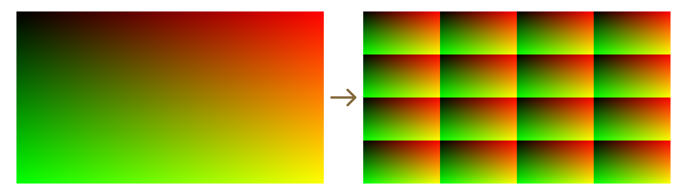

# Разработка комплексного режима предпросмотра (Overview Mode)

## Описание проблемы

При работе с инструментами визуального анализа, стало понятно, что частое переключение между различными режимами отображения быстро становится рутинным и неудобным. Это затрудняет одновременную оценку нескольких параметров PRB и замедляет поиск графических ошибок.

Для решение этой проблемы был разработан режим мультиэкранной визуализации отображаемый в виде сетки (Overview Mode), позволяющий выводить основные аналитические проходы одновременно на один экран.

>Вид режима отображения в виде сетки


## Техническая реализация

### Создание индексной сетки (Grid ID)

Для реализации сегментации экрана необходимо разделить координаты вьюпорта (Screen UV) на блоки, например, форматом 4x4. Чтобы шейдер мог идентифицировать каждую ячейку, используется функция ```floor```.

Функция floor(x) возвращает тоже самое число отбрасывая дробную часть. К примеруЖ ```floor(1.65) = 1.0```
[https://dev.epicgames.com/documentation/en-us/unreal-engine/math-material-expressions-in-unreal-engine#frac]

При умножении координат экранного пространства ```ScreenUV``` (диапазон 0–1) на размер сетки ```grid_size``` и последующем применении ```floor```, получаются целочисленные индексы ячеек.
Параметр ```UV_offset``` является заверзевированным и даёт возможность в будущем сдвигать сетку в разные стороны экрана.

```
// grid_size = 4 (by default)
// UV_offset = 0 (by defautl)

float2 gridID = floor(ScreenUV * grid_size + UV_offset);
```

> Визуализация индексной сетки 4x4


Полученная сетка (gridID) используется в качестве маски для распределения режимов отрисовки. Каждому сегменту соответствует свое значение в виде двумерного вектора. Например, значение ```x = 1; y = 2``` определяет сегмент во втором столбце и третьей строке, так как индексация начинается с ```0```.

### Генерация локальных координат сегментов (Local UV)

Помимо определения индексов ячеек, необходимо подготовить систему координат внутри каждого сегмента для того, чтобы шейдер мог просэмлировать изображение в пределах заданной области ячейки. Для этого применяется функция ```frac```.

Функция ```frac(x)``` возвращает дробную часть числа. К примеру: ```frac(1.65) = 0.65```
[ссылка выше]

Использование этой функции позволяет получить повторяющийся диапазон координат от 0 до 1 внутри каждой ячейки сетки.

```
// Create local UV for each segment
float2 localUV = frac(ScreenUV * grid_size + UV_offset);
```

> Визуализация локальных UV-сегментов 4x4


Локальные координаты localUV необходимы для того, чтобы в каждой ячейке отображался полный аналитический проход (например, Albedo Check или Lighting Check) в уменьшенном масштабе. Без использования этого метода в сегментах отображались бы лишь части общей сцены, соответствующие их глобальному положению на экране.

### Оптимизация центрального сегмента сетки

#### Описание проблемы

При стандартном разбиении экрана на сетку 4x4 каждый сегмент имеет свои локальные UV-координаты от 0 до 1. Если требуется выделить центральную область (занимающую, например, 2x2 малых сегмента) под увеличенное превью, возникает проблема: вместо одного крупного изображения в центре отрисовываются четыре идентичных уменьшенных копии. 

Для корректного отображения необходимо пересчитать координаты для центральной зоны так, чтобы четыре отдельные ячейки объединились в единое пространство с общим диапазоном координат [0, 1].

#### Решение: Масштабирование и смещение координат

Для объединения центральных ячеек используется математическая трансформация входных координат ```ScreenUV```. Необходимо растянуть область, находящуюся в центре экрана, на весь диапазон [0, 1].

В выражении $((ScreenUV - 0.25) * 2.0)$ происходят следующие операции:

1. Смещение ($- 0.25$): Мы сдвигаем начало координат. Поскольку центральная область в сетке 4x4 начинается с отметки 0.25 (первая четверть экрана) и заканчивается на 0.75, вычитание 0.25 перемещает начало нужной нам области в точку 0.

2. Масштабирование ($* 2.0$): Так как ширина целевой области составляет 0.5 от ширины экрана ($0.75 - 0.25 = 0.5$), умножение на $2$ растягивает этот диапазон до полноценных [0, 1].

```
float2 centerUV = ViewportUVToSceneTextureUV(((ScreenUV - 0.25) * 2.0), 14);
```

> Визуализация исправления центрального сегмента


### Решение проблемы масштабирования при разном разрешении рендеринга

#### Описание проблемы (Screen Percentage)

В Unreal Engine часто используется настройка Screen Percentage (динамическое разрешение), при которой фактическое разрешение рендеринга сцены меньше, чем разрешение вьюпорта или финального кадра.

При использовании стандартных ScreenUV в Post-Process материале возникает ошибка масштабирования: аналитические данные (миниатюры в сетке) отрисовываются в неверном масштабе и смещаются, так как координаты вьюпорта не совпадают с координатами в текстурных буферах G-Buffer. Это приводит к тому, что изображение внутри сегмента не заполняет его целиком или выглядит уменьшенным.

> Вид сетки при некорректном масштабировании (Screen Percentage < 100%)


#### Решение: Приведение координат к размеру буфера

Для исправления этой ошибки необходимо рассчитать коэффициент соотношения (ratio) между размером вьюпорта (то, что видит пользователь) и размером буфера (то, где движок хранит данные G-Buffer).

Логика вычислений:

1. ```View.ViewSizeAndInvSize.xy``` - содержит текущую ширину и высоту вьюпорта в пикселях. [ССЫЛКА НА ОПИСАНИЕ СТРУКТУРЫ VIEW]

2. ```View.BufferSizeAndInvSize.zw``` - содержит значения обратного размера буфера ($1/width$ и $1/height$).

3. Перемножение этих значений дает поправочный коэффициент, который позволяет сопоставить пиксели экрана с пикселями в буффере.

```
float2 ratio = View.ViewSizeAndInvSize.xy * View.BufferSizeAndInvSize.zw;

float2 gBufferUV = localUV * ratio;
```

#### Вывод

Использование ```gBufferUV``` вместо обычных ```localUV``` гарантирует, что каждый аналитический проход будет корректного размера относительно своей ячейки сетки независимо от того, какое разрешение рендеринга установлено в настройках проекта или консольной командой ```r.ScreenPercentage```.

## Вывод
[дописать вывод!]

[Что такое маска (лэйоут)]