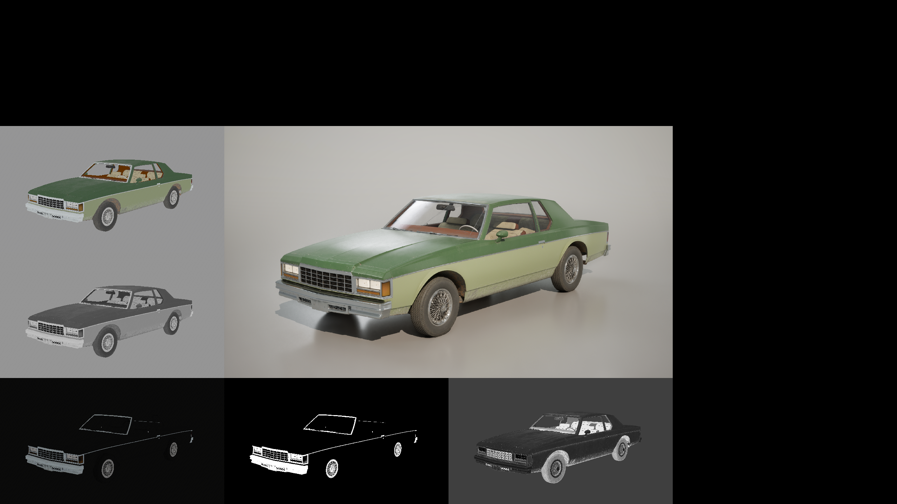
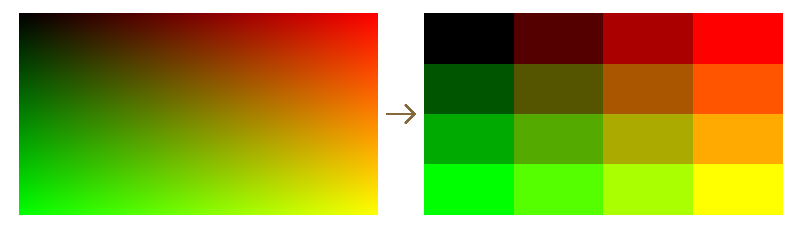
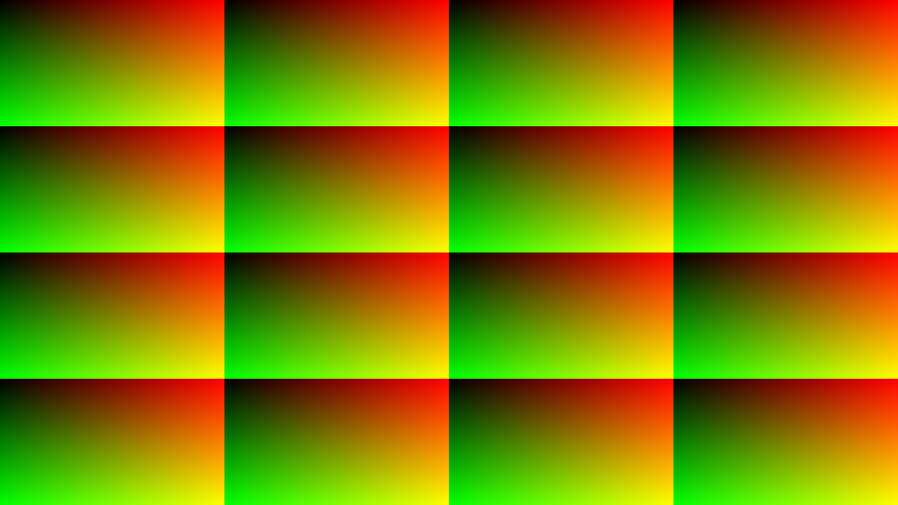
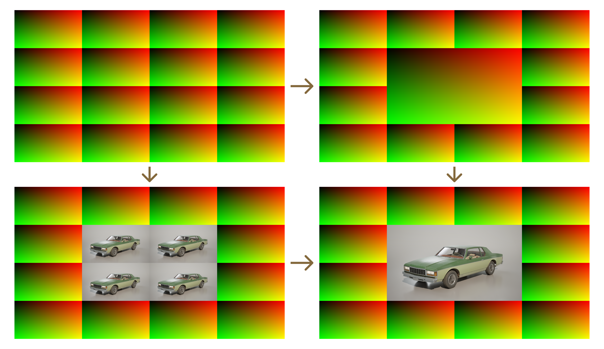
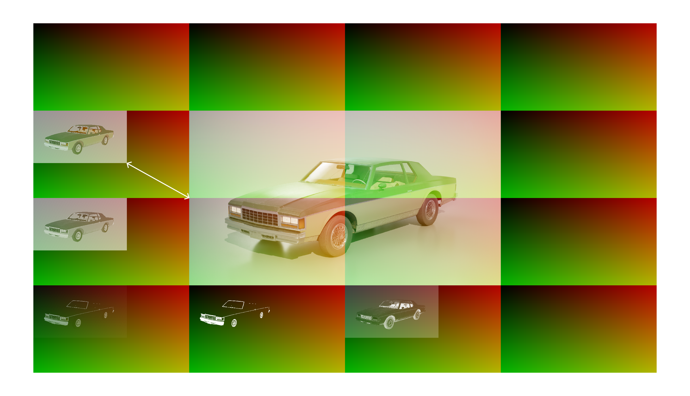

# Новый View Mode

## Проблема

Была проблема, что при работе с визуализатором[?] было неудобно, когда приходилось часто переключаться между режимами визуалиции.[!]

Для решения этой проблемы было решение сделать режим отображение[?] в виде сетки, где будут видны сразу все режимы визаулизации.[!]

> Вид режима отображения


## Решение

### Создание сетки

Для начала нам нужно взять нашу UV вьюпорта и разбить сегменты вида 4x4 блока.[!][расписать, что такое floor (и его представление в виде математической форулы), какие параметры принимаются ещё тут и зачем]

```
// grid_size = 4 (by default)
// UV_offset = 0 (by default)

float2 grid = floor(ScreenUV * grid_size + UV_offset);
```

> [?]


Данная сетка будет использоваться в качестве маски, чтобы указать что и в каком поле должно отрисовываться.[!]
У каждого сегмента есть своё значение цвета представленная ввиде двумерного вектора (массива).[!]
К примеру значения ```x = 1; y = 2``` означает сегмент во втором ряду в третьей строчке (так как нумерация сегментов начинается от 0).[!]


Помимо маски сегментов нам ещё необъодимо разбить нашу UV экрана на сетку из UV сегментов.[!][что такое frac (его представление в виде мат. форму) и всё остальное]

```
// grid_size = 4 (by default)
// UV_offset = 0 (by default)

float2 localUV = frac(ScreenUV * grid_size + UV_offset);
```
> [?]


[Объяснение зачем сетка из uv сегментов]

### Решение проблемы с центральным сегментом

Проблема в том, что центральный элемент должен быть больше остальных и должен занимать 4 сегмента, но 4 uv делают рендер 4 раза, дла этого нужно пересчитать совместить 4 uv в центре в 1. Для этого нужно их пересчитать.[!][объясни код]

```
float2 centerUV = ViewportUVToSceneTextureUV(((ScreenUV - 0.25) * 2.0), 14);
```

> [?]


### Решение проблемы с масштабированием разрешения рендеринга

Была проблема, что из-за настройки процента разрешения рендеринга в сегментах картинка рендерилась в меньшем размере, чем занимает весь сегмент.[!]

> [?]


Для решение этой проблемы добавили пересчёт uv с чего-то.[!]

```
float2 ratio = View.ViewSizeAndInvSize.xy * View.BufferSizeAndInvSize.zw;
float2 gBufferUV = localUV * ratio;
```

> фото исправленное выше