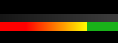
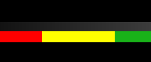

# **Разработка логики визуализации**

После выбора архитектуры Post-Process материала и определения физически корректных диапазонов, основным этапом разработки стала программная реализация алгоритмов анализа данных G-Buffer. Целью было создать систему, которая в реальном времени анализирует значения GBuffer и выводит цветовую индикацию отклонений от физически допустимых диапазонов.

В основе решения лежит Post-Process Material, работающий в пространстве экрана (Screen Space). Это позволяет анализировать уже рассчитанные данные G-Buffer без модификации исходных материалов сцены.

## **1. Подготовка материала**

Процесс разработки начался с создания базового материала. Для того чтобы материал функционировал как шейдер постобработки, в настройках материала параметр Material Domain был переведен в значение Post-Process.


Важным аспектом является настройка Blendable Location. Мы оставили стандартное значение Scene Color After Tonemapping. Это необходимо по нескольким причинам:

К этому моменту движок уже завершил все вычисления освещения и применил тональную компрессию (Tonemapping), что позволяет нам проверять яркость освещение, а так же накладывать отладочную информацию поверх финального изображения.


## **2. Алгоритм дешифрации данных G-Buffer**

В Unreal Engine 5 доступ к параметрам материала в пост-процессе осуществляется через функцию ```SceneTextureLookup```. Однако для корректного анализа данных необходимо выполнить ряд предварительных операций.

### **Подготовка координат и выборка данных**

В разработанном модуле используется HLSL-код для извлечения параметров. Пример базовой подготовки:

```
1  float2 ScreenUVFix = ViewportUVToSceneTextureUV(ScreenUV, TexIndex);
2  float2 CenterUVFix = ViewportUVToSceneTextureUV(float2(0.5, 0.5), TexIndex);
3  float4 CenterPixelValue = SceneTextureLookup(CenterUVFix, TexIndex, false);
4  float4 Scene = SceneTextureLookup(ScreenUVFix, TexIndex, false);
```

Разбор кода:

* **Строка 1 (Реконструкция UV):** Мы используем ```ViewportUVToSceneTextureUV```, потому что в Unreal Engine область отрисовки (Viewport) может не совпадать с размером текстуры сцены (например, при использовании динамического разрешения (Dynamic Resolution) или настроек процент разрешения экрана (Screen Percentage)). Эта реконструкция (фикс) приводит экранные координаты к правильному виду для точной выборки из G-Buffer.

* **Строка 2-3 (Центральный пиксель):** Мы принудительно вычисляем координаты центра экрана (```0.5, 0.5```). Это необходимо для работы интерактивного интерфейса: когда пользователь наводит прицел на объект, система должна знать точное значение параметра именно в этой точке, чтобы вывести его в числовом виде на экран.

* **Строка 4:** Выборка данных для всего остального изображения для общей визуализации.

### **Подготовка координат и выборка данных**

Так как информация в буферах часто интерпретируется через 8-битный формат (255 оттенков), нам необходимо привести эти значения к стандартному для шейдеров диапазону от ```0.0``` до ```1.0```.

Важно отметить, что значения мы используем числа с плавающей запятой (float). Формат float позволяет оперировать дробными значениями (например, 0.523), что критически важно для точности PBR-расчетов, где разница между 0.02 и 0.04 может означать, к примеру двукратное изменение яркости отражения.

```
1  RemapValues.x = RemapValues.x / 255;
2  RemapValues.y = RemapValues.y / 255;
3  RemapValues.z = RemapValues.z / 255;
4  RemapValues.w = RemapValues.w / 255;
```

### **Преобразование в яркость (Luminance)**

Для анализа параметров, к примеру таких как **Albedo**, необходимо перевести цветное значение пикселя в черно-белое (яркость). Это делается путем умножения каналов RGB на весовые коэффициенты:

```
1  float CenterLuminance = dot(CenterPixelValue, float3(0.299, 0.587, 0.114));
```

* Эти коэффициенты учитывают физиологию человеческого зрения: человеческий глаз гораздо чувствительнее к зеленому цвету и менее чувствителен к синему. Данный стандарт (ITU-R BT.601) позволяет получить "воспринимаемую яркость", которая наиболее точно соответствует тому, как человек видит материал в сцене.

* Математически операция ```dot()``` (скалярное произведение двух векторов) идентична ручному сложению: (```R*0.299 + G*0.587 + B*0.114```). Использование функции ```dot()``` является предпочтительным, так как она аппаратно ускорена на GPU и выполняется быстрее, чем несколько последовательных операций умножения и сложения.

## **3. Реализация функции валидации (на примере Albedo)**

Ниже представлена логика функции, которая окрашивает пиксели в зависимости от их попадания в диапазоны. В функцию передается яркость пикселя (Pixel) и вектор пороговых значений (T - Thresholds).

```
 1    float4 Albedo(float Pixel, float4 T)
 2    {
 3        if (Pixel <= T.x) // Too Dark
 4        {
 5            R = 1.0;
 6            G = 0.0;
 7            B = 0.0;
 8        }
 9
10          else if (Pixel <= T.y) // Exceptions
11          {
12              float Range = T.y - T.x;
13  
14              R = 1,0;
15              G = (Pixel - T.x) / Range;
16              B = 0.0;
17          }
18  
19          else if (Pixel <= T.z) // Right
20          {
21              R = 0.1;
22              G = 0.7;
23              B = 0.1;
24          }
25
26          else if (Pixel <= T.w) // Exceptions
27          {
28              float Range = T.w - T.z;
29        
30              R = 0.0;
31              G = 1 - ((Pixel - T.z) / Range);
32              B = 1.0;
33          }
34
35          else // Too Bright
36          {
37              R = 0.0;
38              G = 0.0;
39              B = 1.0;
40          }
41
42          return float4(R, G, B, 1.0);
43      }
```

Для плавного перехода значений из "некорректных" в "приемлемые", добавляем логику ```(Pixel - T.x) / Range```, который создает плавный переход цвета. Это помогает понять, насколько близко значение подошло к критической отметке, позволяя делать материалы "на грани", если того требует художественный замысел (например, очень темная резина).  
  
C плавным переходом 
  
  
Без плавного переходом 

## **4. Реализация интерактивного интерфейса**

Для обеспечения удобства и точной диагностики в модуль были интегрированы прицел и динамическая шкала.
Прицел обозначает центр экрана, откуда будет считываться цвет пикселя.

### **Отрисовка адаптивного прицела (Crosshair)**

Прицел должен оставаться читаемым вне зависимости от того, на объект какого цвета он наведен. В HLSL это реализовано через инверсию цвета.

```
 1  float2 Center = float2(0.5, 0.5);
 2  // Определение области прицела
 3  if (abs(ScreenUV.y - Center.y) < CrosshairThickness.y && abs(ScreenUV.x - Center.x) < CrosshairSize.x)
 4  {
 5     float4 result = 1 - Scene; // Базовая инверсия цвета
 6     // Дополнительная коррекция для серых зон, где инверсия дает тот же серый
 7     if ((CenterLuma > .3) || (CenterLuma < .6))
 8     {
 9         result = result - float4(.15, .15, .15, 1.);
10     }
11     return result;
12  }
```

Такой подход гарантирует, что если прицел наведен на черную область, он станет белым, и наоборот. Если же фон серый, включается дополнительное смещение яркости, чтобы сохранить контур прицела.

### **Визуализация значений на статус-баре (Status Bar)**

Для визуального сопоставления текущего значения с допустимыми пределами в нижней части экрана отрисовывается полоса (Status Bar). Она разделена на цветовые зоны и содержит бегунок (Indicator), положение которого зависит от считанного значения из центрального пикселя.

```
1  // Вычисление нормализованного положения индикатора
2  float IndicatorPos = Value; 
3  float DistanceToIndicator = abs(BarUVX - IndicatorPos);
4
5  // Отрисовка bylbrfnjhf
6  if (DistanceToIndicator < (IndicatorWidth / 2.0)) 
7  {
8      return float4(1, 1, 1, 1); // Белый цвет линии бегунка
9  }
```

Программная отрисовка элементов интерфейса непосредственно в коде шейдера позволяет езменять его в реальном времени и избежать использования дополнительных текстур, что делает инструмент гибким и полностью автономным.

## **Вывод**


Таким образом, в рамках данной задачи была реализована полноценная логика визуализации и валидации PBR-параметров на уровне Post-Process шейдера. Разработанный алгоритм обеспечивает корректную выборку данных из G-Buffer, их нормализацию и анализ в соответствии с физически допустимыми диапазонами, а также наглядную цветовую индикацию отклонений. Интеграция интерактивных элементов интерфейса (прицел и статус-бар) позволила превратить систему из простого отладочного оверлея в удобный инструмент технической диагностики, работающий в реальном времени и не требующий модификации исходных материалов сцены.

